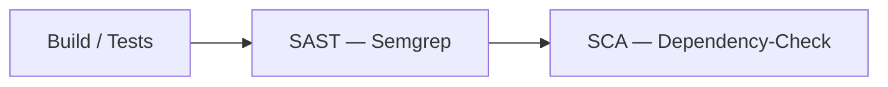
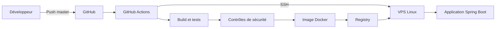

# Test technique Lead DevOps — AfricFinance

Ce dépôt contient un test technique « Zero-to-Deploy ». L'application Spring Boot
sert de support à la future chaîne CI/CD, dont l'objectif final est d'automatiser
le build, les tests, l'analyse, la conteneurisation et le déploiement.

## État actuel

Le projet contient actuellement :

- Java 21 ;
- Spring Boot ;
- Maven ;
- un endpoint HTTP `GET /` ;
- un test MVC ;
- une image Docker multi-stage ;
- un pipeline CI de référence GitHub Actions ;
- un Jenkinsfile équivalent fourni comme variante non exécutée.

## Architecture applicative

```text
Client HTTP
    |
    v
Spring Boot
    |
    v
GET /
    |
    v
Réponse JSON
```

Réponse attendue :

```json
{
  "message": "Hello AfricFinance",
  "status": "running"
}
```

## Prérequis de développement

L'application nécessite Java 21 et Maven. Les tests peuvent également être
exécutés dans un conteneur Maven/Java 21 lorsque Docker est disponible.

## Tests

Commande locale :

```bash
mvn clean test
```

Commande Docker utilisée pendant la validation :

```bash
docker run --rm \
  -v "$PWD:/workspace" \
  -w /workspace \
  maven:3.9-eclipse-temurin-21 \
  mvn clean test
```

Résultat constaté : 1 test exécuté, 1 test réussi, 0 échec, avec `BUILD SUCCESS`.

## Packaging

```bash
mvn clean package
```

JAR produit :

```text
target/africfinance-app-0.0.1-SNAPSHOT.jar
```

## Exécution locale

```bash
java -jar target/africfinance-app-0.0.1-SNAPSHOT.jar
```

Puis :

```bash
curl http://localhost:8080/
```

## Choix du moteur CI/CD

Le sujet technique autorise l'utilisation de Jenkins, GitHub Actions ou GitLab
CI.

Pour cette réalisation, GitHub Actions a été retenu comme pipeline de
référence car le dépôt du test est hébergé sur GitHub. Ce choix permet
d'exécuter et de démontrer le pipeline directement depuis le dépôt, sans
nécessiter le déploiement d'une infrastructure CI supplémentaire.

Le dépôt contient donc :

- `.github/workflows/ci-cd.yml` : pipeline principal utilisé pour l'exécution
  du test sur GitHub ;
- `Jenkinsfile` : implémentation alternative du pipeline pour un environnement
  Jenkins.

### GitHub Actions — pipeline de référence

GitHub Actions constitue l'implémentation opérationnelle retenue pour ce test.

Il permet notamment :

- le déclenchement automatique sur un push vers `master` ;
- l'exécution directe depuis le dépôt GitHub ;
- l'intégration des tests et contrôles DevSecOps ;
- l'évolution vers la construction et la publication de l'image Docker ;
- l'évolution vers le déploiement automatisé sur le VPS.

L'objectif est de pouvoir démontrer réellement la chaîne Zero-to-Deploy dans
l'environnement où le dépôt est hébergé.

### Jenkins — implémentation alternative

Un `Jenkinsfile` est également livré afin de fournir une implémentation
équivalente pour une infrastructure Jenkins.

Le Jenkinsfile suit autant que possible les mêmes étapes et les mêmes contrôles
que le workflow GitHub Actions.

Il permet de montrer que la conception du pipeline n'est pas dépendante
exclusivement de GitHub Actions et qu'elle peut être transposée vers un moteur
CI/CD Jenkins.

Dans le cadre de ce test, aucune instance Jenkins n'étant disponible, le
Jenkinsfile est fourni et revu structurellement mais n'est pas présenté comme
ayant été exécuté ou validé sur un serveur Jenkins.

| Moteur | Fichier | Rôle | État de validation |
|---|---|---|---|
| GitHub Actions | `.github/workflows/ci-cd.yml` | Pipeline de référence du test | Syntaxe validée localement ; exécution GitHub à confirmer après push |
| Jenkins | `Jenkinsfile` | Implémentation alternative pour Jenkins | Fourni et revu ; non exécuté faute d'instance Jenkins |

Lorsque de nouvelles étapes sont ajoutées au pipeline (SAST, SCA, Trivy,
Registry, déploiement, DAST), la cohérence fonctionnelle entre GitHub Actions
et Jenkins est maintenue autant que raisonnablement possible.

En résumé : GitHub Actions est le pipeline effectivement choisi pour réaliser
et tester le sujet sur GitHub ; le Jenkinsfile est la deuxième implémentation
livrée pour démontrer la compatibilité avec Jenkins.

## Sécurité applicative

Les contrôles de sécurité sont placés après les tests et le packaging, avant
les futures étapes de construction ou de promotion d'une image. Ils sont
bloquants en cas d'erreur réelle de l'outil ou de détection au-dessus du seuil
configuré.

### SAST — Semgrep

Semgrep analyse le code Java source avec le ruleset `p/java`. Il s'exécute dans
GitHub Actions après le packaging, sans secret externe, et bloque le pipeline
si l'outil rencontre une erreur ou signale une règle en échec. Le même contrôle
est fourni dans le Jenkinsfile via l'image Docker Semgrep `1.139.0`, mais n'y a
pas été exécuté.

Ce contrôle détecte des patterns connus ; il ne remplace ni une revue de code
ni des tests de sécurité complets.

### SCA — OWASP Dependency-Check

Dependency-Check analyse les dépendances Maven et génère les rapports HTML et
JSON dans `target/dependency-check-report.*`. Une vulnérabilité de score CVSS
supérieur ou égal à `7.0` est bloquante, seuil retenu pour traiter les risques
élevés sans rendre le pipeline excessivement strict pour ce test.

Le workflow publie ces rapports comme artefact GitHub Actions. La variable
`NVD_API_KEY` est un secret GitHub optionnel : elle peut améliorer la fiabilité
et les performances des téléchargements NVD, mais aucune clé n'est inventée
ou stockée dans le dépôt. Sans clé, l'exécution peut être ralentie ou limitée
par les restrictions du service NVD.

Les rapports et données locaux générés par cet outil ne sont pas commités.

Le flux CI est le suivant :



Ces contrôles sont implémentés dans les deux pipelines, mais leur exécution
GitHub Actions doit être confirmée après push. Le Jenkinsfile reste une
variante non certifiée faute d'instance Jenkins disponible.

## Architecture cible

Cette architecture correspond à la cible du test et non à l'état déjà implémenté.



Cette architecture représente la cible du test. Les composants seront ajoutés progressivement au cours de l'implémentation.

## Roadmap du test

- [x] Application Spring Boot
- [x] Test applicatif
- [x] Conteneurisation Docker
- [x] Pipeline GitHub Actions
- [x] SAST / SCA
- [ ] Scan de l'image
- [ ] Publication GHCR
- [ ] Déploiement SSH
- [ ] Healthcheck post-déploiement
- [ ] DAST
- [ ] Documentation d'exploitation du VPS
