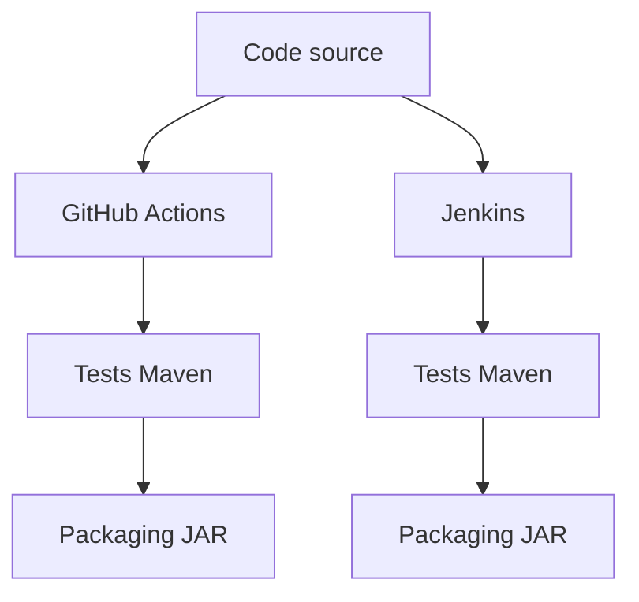
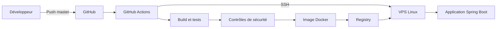

# Test technique Lead DevOps — AfricFinance

Ce dépôt contient un test technique « Zero-to-Deploy ». L'application Spring Boot
sert de support à la future chaîne CI/CD, dont l'objectif final est d'automatiser
le build, les tests, l'analyse, la conteneurisation et le déploiement.

## État actuel

Le projet contient actuellement :

- Java 21 ;
- Spring Boot ;
- Maven ;
- un endpoint HTTP `GET /` ;
- un test MVC ;
- une image Docker multi-stage ;
- un pipeline CI de référence GitHub Actions ;
- un Jenkinsfile équivalent fourni comme variante non exécutée.

## Architecture applicative

```text
Client HTTP
    |
    v
Spring Boot
    |
    v
GET /
    |
    v
Réponse JSON
```

Réponse attendue :

```json
{
  "message": "Hello AfricFinance",
  "status": "running"
}
```

## Prérequis de développement

L'application nécessite Java 21 et Maven. Les tests peuvent également être
exécutés dans un conteneur Maven/Java 21 lorsque Docker est disponible.

## Tests

Commande locale :

```bash
mvn clean test
```

Commande Docker utilisée pendant la validation :

```bash
docker run --rm \
  -v "$PWD:/workspace" \
  -w /workspace \
  maven:3.9-eclipse-temurin-21 \
  mvn clean test
```

Résultat constaté : 1 test exécuté, 1 test réussi, 0 échec, avec `BUILD SUCCESS`.

## Packaging

```bash
mvn clean package
```

JAR produit :

```text
target/africfinance-app-0.0.1-SNAPSHOT.jar
```

## Exécution locale

```bash
java -jar target/africfinance-app-0.0.1-SNAPSHOT.jar
```

Puis :

```bash
curl http://localhost:8080/
```

## Moteurs CI/CD fournis

### GitHub Actions

GitHub Actions est le pipeline de référence et l'implémentation opérationnelle
prévue pour ce dépôt. Il est déclenché automatiquement sur un push vers
`master` et peut également être lancé manuellement avec `workflow_dispatch`.
Il exécute les tests Maven puis le packaging du JAR. Son exécution réelle doit
être confirmée dans GitHub après publication du dépôt.

### Jenkins

Le `Jenkinsfile` fournit une implémentation alternative de la même logique CI :
checkout, tests Maven et packaging. Il n'a pas été exécuté dans le cadre du
test, car aucune instance Jenkins n'est disponible ; il ne doit donc pas être
présenté comme certifié.

| Pipeline | Implémenté | Exécuté | Rôle |
|----------|------------|---------|------|
| GitHub Actions | Oui | À confirmer après push | Pipeline de référence |
| Jenkinsfile | Oui | Non | Variante compatible Jenkins |

Les deux pipelines suivent le même flux : source, tests Maven, puis packaging
du JAR, avec Java 21.



GitHub Actions est utilisé comme implémentation opérationnelle dans le cadre
du test.

## Architecture cible

Cette architecture correspond à la cible du test et non à l'état déjà implémenté.



Cette architecture représente la cible du test. Les composants seront ajoutés progressivement au cours de l'implémentation.

## Roadmap du test

- [x] Application Spring Boot
- [x] Test applicatif
- [x] Conteneurisation Docker
- [x] Pipeline GitHub Actions
- [ ] SAST / SCA
- [ ] Scan de l'image
- [ ] Publication GHCR
- [ ] Déploiement SSH
- [ ] Healthcheck post-déploiement
- [ ] DAST
- [ ] Documentation d'exploitation du VPS
