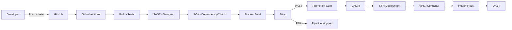

# AfricFinance — Pipeline CI/CD Zero-to-Deploy

AfricFinance est une application Spring Boot minimale servant de support à une
chaîne CI/CD de livraison d'artefacts Java et conteneurisés. Le dépôt fournit
le pipeline principal GitHub Actions ainsi qu'un `Jenkinsfile` transposable
dans un environnement Jenkins.

## Table des matières

- [Architecture](#architecture)
- [Application](#application)
- [Pipeline CI/CD](#pipeline-cicd)
- [Chaîne DevSecOps](#chaîne-devsecops)
- [Image Docker](#image-docker)
- [GitHub Actions](#github-actions)
- [Jenkins](#jenkins)
- [Frontières de confiance](#frontières-de-confiance)
- [Secrets et credentials](#secrets-et-credentials)
- [Exploitation](#exploitation)
- [Dépannage](#dépannage)
- [Limites et évolutions](#limites-et-évolutions)

## Architecture

Les éléments en pointillés représentent des intégrations prévues mais absentes
de la configuration actuelle.



## Application

L'application utilise Java 21, Spring Boot et Maven. Elle expose le port
`8080` et fournit un endpoint HTTP `GET /` avec une réponse JSON déterministe :

```json
{
  "message": "Hello AfricFinance",
  "status": "running"
}
```

### Tests et packaging

```bash
mvn clean test
mvn clean package
```

Le JAR produit est `target/africfinance-app-0.0.1-SNAPSHOT.jar`.

### Exécution locale

```bash
java -jar target/africfinance-app-0.0.1-SNAPSHOT.jar
curl http://localhost:8080/
```

## Pipeline CI/CD

Le pipeline est une chaîne de promotion :

```text
Commit
  ↓
Build
  ↓
Tests
  ↓
SAST
  ↓
SCA
  ↓
Container Build
  ↓
Container Security Gate
  ↓
Registry
  ↓
Deployment
  ↓
Runtime Verification
```

Un artefact ne progresse vers l'étape suivante que lorsque les gates
bloquantes précédentes réussissent. La publication GHCR intervient uniquement
après le build, le scan Trivy et la réussite de la gate de promotion.

## Chaîne DevSecOps

Les contrôles sont appliqués sur des surfaces complémentaires :

| Surface | Contrôle | Outil | Fonction |
|---------|----------|-------|----------|
| Fonctionnel | Tests | Maven / JUnit | Validation du comportement |
| Code | SAST | Semgrep | Analyse statique |
| Supply chain | SCA | OWASP Dependency-Check | Vulnérabilités des dépendances |
| Container | Image scanning | Trivy | Vulnérabilités de l'artefact |
| Runtime | Least privilege | Docker non-root | Réduction des privilèges |

Le DAST HTTP avec OWASP ZAP appartient à une intégration ultérieure et n'est
pas présent dans la configuration actuelle.

### Security gates

```text
PASS
  │
  ▼
Promotion

FAIL
  │
  ▼
Pipeline stopped
```

La promotion de l'image est bloquée lorsqu'une vulnérabilité `HIGH` ou
`CRITICAL` corrigible est détectée par Trivy. Les vulnérabilités sans correctif
disponible sont signalées mais ne bloquent pas cette gate. Une erreur de
scanner ou une violation de seuil bloque le pipeline.

Une image construite n'est pas automatiquement déployable. Elle devient
candidate à la promotion uniquement après les contrôles applicables :

```text
Build → Scan → Promote → Deploy
```

## Image Docker

Le `Dockerfile` utilise un build multi-stage :

- le stage de build utilise Maven avec Java 21 ;
- Maven et les outils de compilation ne sont pas présents dans le runtime ;
- le runtime utilise un JRE Java 21 ;
- l'application s'exécute avec l'utilisateur non privilégié `app` ;
- seul le JAR applicatif est copié dans l'image finale ;
- le port `8080` est exposé.

Commandes usuelles :

```bash
docker build -t africfinance-app:local .
docker run --rm --name africfinance-app -p 8080:8080 africfinance-app:local
```

## GitHub Actions

Le workflow `.github/workflows/ci-cd.yml` constitue le moteur d'exécution
principal. Il est déclenché par un push vers `master` ou par
`workflow_dispatch`.

Il orchestre les étapes suivantes avec Java 21 et le cache Maven :

1. checkout du dépôt ;
2. tests Maven ;
3. packaging du JAR ;
4. SAST Semgrep ;
5. SCA OWASP Dependency-Check ;
6. construction de l'image Docker ;
7. gate Trivy sur l'image construite ;
8. authentification et publication dans GHCR.

Le workflow ne contient actuellement aucune connexion SSH ni aucun déploiement
VPS. Le rapport Dependency-Check est conservé comme artefact du workflow.

Le workflow utilise les permissions minimales `contents: read` et
`packages: write`. L'authentification GHCR repose sur `GITHUB_TOKEN` et ne
nécessite pas de PAT supplémentaire.

## Registry et promotion des images

GHCR est le registre des images publiées par GitHub Actions. L'image est
construite et analysée une seule fois, puis retaguée et poussée après la gate
Trivy ; aucun rebuild n'intervient entre le scan et la publication.

Les références publiées sont :

```text
ghcr.io/<owner>/africfinance-app:sha-<git-sha>
ghcr.io/<owner>/africfinance-app:latest
```

Le tag `sha-<git-sha>` est immuable dans la convention de livraison et assure
la traçabilité du commit vers l'image. Le tag `latest` est associé aux
exécutions sur `master`. L'image publiée est le même artefact que celui
analysé par Trivy.

La séquence de promotion est :

```text
Build → Scan → Promote → Deploy
```

Une violation d'une gate ou un échec d'authentification GHCR arrête le
pipeline avant publication.

## Jenkins

Le fichier `Jenkinsfile` fournit l'équivalent Jenkins de la chaîne :

```text
Checkout → Tests → Packaging → SAST → SCA → Docker Build → Trivy
```

Les étapes Maven peuvent utiliser un agent conteneurisé Java 21/Maven. Les
étapes Docker et Trivy sont affectées à un agent Jenkins dédié portant le
label `container-build`.

Cet agent doit disposer de Docker, Trivy, d'un espace disque suffisant, d'un
accès réseau contrôlé et d'un workspace isolé. Le contrôleur Jenkins conserve
un rôle d'orchestration et n'est pas utilisé comme worker de build. Le socket
Docker du contrôleur n'est pas exposé aux conteneurs de jobs.

## Frontières de confiance

```text
SCM / CI
     │
     ▼
Build environment
     │
     ▼
Security gates
     │
     ▼
Registry
     │
     ▼
Deployment boundary
     │
     ▼
Runtime
```

Le repository fournit le code et la configuration. Le runner GitHub Actions,
ou l'agent Jenkins dédié, exécute les builds dans un environnement séparé.
Les gates contrôlent l'artefact avant toute promotion. Le registre, la
connexion SSH et le VPS constituent des frontières distinctes lorsqu'ils
seront intégrés. Le runtime Docker applique un utilisateur non-root.

## Secrets et credentials

| Secret | Utilisation | Portée |
|--------|-------------|--------|
| `NVD_API_KEY` | Accélérer et fiabiliser les téléchargements NVD de Dependency-Check | Secret GitHub optionnel, limité au workflow CI |
| `GITHUB_TOKEN` | Authentification et publication dans GHCR | Token natif du workflow, permission `packages: write` |
| `ghcr-credentials` | Authentification GHCR du Jenkinsfile | Credential Jenkins username/password sur l'agent de publication |

Aucun secret n'est requis pour les étapes de build, de test, de SAST, de
construction d'image ou de scan Trivy. Les credentials Jenkins doivent être
créés dans Jenkins sans valeur en clair dans le dépôt et avec une portée
minimale.

## Exploitation

### Vérifier le conteneur

```bash
docker ps
docker inspect africfinance-app
```

### Consulter les logs

```bash
docker logs africfinance-app
```

### Tester l'application

```bash
curl -f http://localhost:8080/
```

### Arrêter et supprimer le conteneur

```bash
docker stop africfinance-app
docker rm africfinance-app
```

## Dépannage

### Pipeline Maven en échec

Consulter les logs de compilation et de tests, puis reproduire avec
`mvn clean test` dans un environnement Java 21.

### Security gate en échec

Identifier l'étape concernée dans les logs. Pour Trivy, examiner la sévérité,
le composant affecté et la disponibilité d'un correctif avant de reconstruire
l'image.

### Image introuvable

Vérifier le tag utilisé par `docker build`, puis lister les images locales avec
`docker images africfinance-app`.

### Conteneur non démarré

Consulter `docker logs africfinance-app` et vérifier qu'aucun autre processus
n'utilise le port `8080`.

## Limites et évolutions

Pour une plateforme de production plus complète, les évolutions usuelles
incluent :

- TLS et reverse proxy ;
- rollback automatisé ;
- stratégies blue/green ou canary ;
- observabilité et alerting ;
- Infrastructure as Code ;
- gestionnaire de secrets ;
- SBOM, provenance et signature d'images ;
- policy-as-code.
